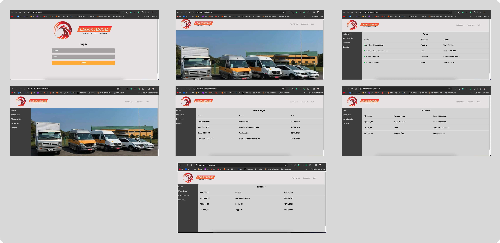

  <p align="center">
   
  </p>

  
<p align="center">
   
  </p>

# :clipboard: Sobre o projeto

Projeto realizado para teste de conhecimentos com programação web.

Abaixo podemos ver o resultado final do projeto. Espero que gostem!

<br>
<p align="center">
   
  </p>

# 🔗 Acesse o site com o link abaixo.

- [Dashboard | Lego Cabral](https://desafio-nine.vercel.app/)

- [Next.js](https://nextjs.org/)
- [Typescript](https://www.typescriptlang.org/)
- [Tailwind css](https://tailwindcss.com/)
- [Shadcn/ui](https://ui.shadcn.com/docs/installation/next)


## 🌐 Para iniciarlizar o projeto utilize o comando abaixo:

```bash

#Clonando o repositório do Github:
$ git clone https://github.com/willtechcod/dashboard-legocabral.git

#Ou Crie um novo projeto:
$ npx create-next-app@latest my-app --typescript --tailwind --eslint

#Acessar pasta dashboard-legocabral:
$ cd dashboard-legocabral

#Instalar alguns packages:

$ npx shadcn-ui@latest init  

#Inicializar pasta dashboard-legocabral:
$ npm run dev

```

##

<p align="center">
  
  </p>
